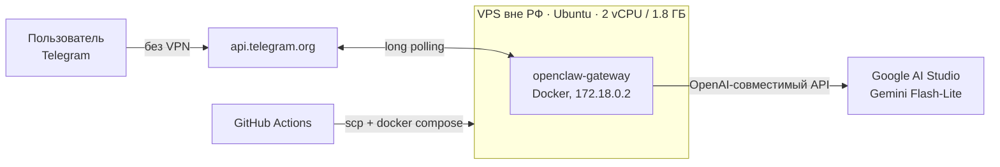

# OpenClaw Gateway — персональный AI-ассистент в Telegram

Работающий экземпляр OpenClaw в Docker на зарубежном VPS, подключённый к Telegram
и Google AI Studio. Бот — [@vibecoder_test_task_bot](https://t.me/vibecoder_test_task_bot).

Репозиторий содержит **не сам OpenClaw**, а всё, что нужно, чтобы его развернуть:
шаблон конфигурации, персону ассистента и пайплайн доставки на сервер.

---

## Архитектура



**Почему VPS, а не свой компьютер.** Деплой на зарубежном сервере выбран для того, чтобы избежать возможной блокировки провайдеров AI-моделей или их подсетей. Без разорачивания на своей машине полноценного VPN пришлось бы искать обходной путь и настраивать прокси, что можно считать равнозначным. Вынос шлюза за пределы РФ
убирает проблему в корне: VPN не нужен ни серверу, ни рабочему устройству.

**Почему Gemini.** Google AI Studio — единственный хороший вариант без карты с рабочими лимитами (15 запросов/минуту,
1500/сутки). Готового провайдера под него в OpenClaw нет, поэтому подключён через
OpenAI-совместимый эндпоинт и собственный `baseUrl`.

---

## Что в репозитории

| Файл | Роль |
|---|---|
| [`openclaw.config.template.json5`](openclaw.config.template.json5) | Шаблон конфигурации. Секреты — плейсхолдерами, подставляются в CI |
| [`SOUL.md`](SOUL.md) | Персона ассистента: тон, формат ответов, границы |
| [`docker-compose.override.yml`](docker-compose.override.yml) | Правка healthcheck под слабую машину |
| [`scripts/bootstrap-remote.sh`](scripts/bootstrap-remote.sh) | Первичная установка на чистом сервере. Идемпотентен |
| [`scripts/deploy-remote.sh`](scripts/deploy-remote.sh) | Права, пересоздание контейнера, ожидание готовности |
| [`.github/workflows/deploy.yml`](.github/workflows/deploy.yml) | Пайплайн: проверки → рендер → доставка → перезапуск |
| [`DEPLOY.md`](DEPLOY.md) | Ручной чек-лист развёртывания |
| [`CICD.md`](CICD.md) | Настройка секретов и пайплайна |

Отрендеренный конфиг в git не попадает — он в `.gitignore`.

---

## Как это работает

Push в `main` → GitHub Actions проверяет, что в репозитории нет секретов и что все
нужные заданы → подставляет их в шаблон → заливает `openclaw.json` и `SOUL.md` на VPS
по SSH → выставляет права → пересоздаёт контейнер → ждёт в логах строку готовности.

Шлюз держит long polling к `api.telegram.org`. Входящее сообщение → агент с персоной
из `SOUL.md` → запрос к Gemini → ответ обратно в Telegram.

### Где что лежит на сервере

| Путь | Что |
|---|---|
| `~/openclaw/` | Клон репозитория OpenClaw с `docker-compose.yml` и `.env` |
| `~/.openclaw/openclaw.json` | Конфигурация. **Только это имя** — другие игнорируются молча |
| `~/.openclaw/workspace/SOUL.md` | Персона. **Только этот каталог** — в корне не читается |
| `~/.openclaw/state/openclaw.sqlite` | Сессии, пары, история |

Контейнер `openclaw-openclaw-gateway-1`, сеть `openclaw_default`, адрес `172.18.0.2`.

---

## Повседневные операции

Все команды — на сервере. `docker compose` требует запуска из `~/openclaw`,
иначе будет `no configuration file provided`.

```bash
# Логи (poll-start отфильтрован — иначе на экране одна вода)
cd ~/openclaw && docker compose logs -f --tail=20 openclaw-gateway \
  | grep --line-buffered -v 'poll-start'

# Состояние
docker compose ps

# Аудит безопасности — лучший способ узнать, что реально открыто
docker exec openclaw-openclaw-gateway-1 openclaw security audit --deep
```

**Дашборд** слушает `0.0.0.0:18789`, но снаружи закрыт файрволом провайдера.
Доступ — только через туннель, с ноутбука:

```bash
ssh -L 18789:127.0.0.1:18789 root@<сервер>
# затем http://127.0.0.1:18789/ — именно этот адрес и порт,
# другие origin шлюз отклонит. Токен: grep TOKEN ~/openclaw/.env
```

**Кто может писать боту** — переменная репозитория, без правки кода:

```bash
gh variable set TELEGRAM_DM_POLICY --body allowlist   # только владелец
gh variable set TELEGRAM_DM_POLICY --body open        # все
gh workflow run deploy.yml                            # применить
```

---

**Диагностика**

- Проверка готовности искала в логах `[gateway] ready` и не находила: шлюз красит
  теги, и между тегом и словом стоят ANSI-коды. Глазом строка видна, для `grep` её нет.
- Фильтр `paths` в workflow не включал `scripts/**` — правка скрипта не запускала
  деплой и молча не доезжала до сервера.


## Не закрыто

- **Правила nftables живут только в памяти.** Таблицу создаёт VPN-сервис; при его
  перезапуске или перезагрузке машины правила исчезнут и бот замолчит — молча.
  Нужно прописать их туда, где таблица создаётся.
- **`dmPolicy: open`** — осознанный компромисс на время проверки. OpenClaw прямо
  документирует, что не является границей безопасности для взаимно недоверяющих
  пользователей. После проверки вернуть `allowlist`.
- **`browser control: enabled`** — единственный не запрещённый инструмент.
  Ассистенту в мессенджере не нужен, стоит добавить в `tools.deny`.
- **Пайплайн не проверяет, что бот отвечает** — только что контейнер поднялся.
  Ровно поэтому сетевая поломка обнаружилась вручную, а не деплоем.
